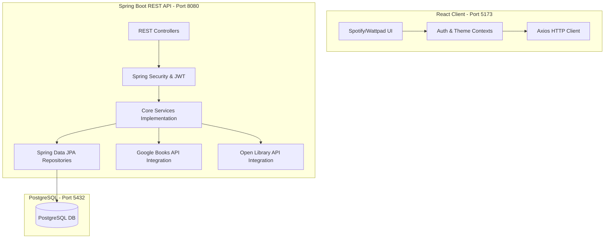

# ReadQuest: Personalized Reading Scheduler & Gamified Tracker

ReadQuest is a premium, production-ready full-stack SaaS application that transforms reading from a chore into a gamified quest. It integrates Outread-style speed testing, custom reading plans, Spotify/Wattpad-style aesthetics, and Habitic/Duolingo-style reward systems.

---

## 🏗️ Architecture Design & Diagram

ReadQuest follows a strictly decoupled, layered architecture:



---

## 📁 Project Folder Structure

```
ReadQuest/
├── database/            # Database configurations and seeds
│   ├── schema.sql       # Create namespace schema
│   ├── tables.sql       # Database table definitions (15 tables)
│   ├── constraints.sql  # Relational foreign keys and checks
│   ├── indexes.sql      # Database indexing for high performance
│   ├── sample_data.sql  # Default roles, classifications, badges, and user seeds
│   └── README.md        # Database execution guide
│
├── backend/             # Spring Boot Maven Project
│   ├── src/main/java/com/readquest/backend/
│   │   ├── config/      # Spring configurations (CORS, REST template)
│   │   ├── controller/  # REST API controllers
│   │   ├── dto/         # Request & Response data transfer objects
│   │   ├── entity/      # JPA Entity models
│   │   ├── exception/   # Custom exceptions and Global Exception Handler
│   │   ├── external/    # Google Books & Open Library service integrations
│   │   ├── repository/  # JPA Repository interfaces
│   │   ├── scheduler/   # Background jobs (daily streak resets)
│   │   ├── security/    # JWT Provider, UserDetails adapters, Filters
│   │   └── service/     # Core Business logic contracts & implementations
│   ├── pom.xml          # Maven dependencies config
│   └── src/main/resources/
│       ├── application.yml        # Global config
│       └── application-dev.yml    # Development overrides
│
└── frontend/            # React Vite Project
    ├── src/
    │   ├── assets/      # Media and badge designs
    │   ├── components/  # Reusable widgets (Navbar, Sidebar, ProgressRing, Heatmap, Chart)
    │   ├── context/     # Global state context providers (AuthContext, ThemeContext)
    │   ├── pages/       # Layout pages (Dashboard, SpeedTest, E-Reader focus panel)
    │   ├── App.jsx      # Route controllers and guards
    │   ├── main.jsx     # App mounting point
    │   └── index.css    # Typography, glassmorphism templates, dark/light themes
    ├── package.json     # Node script controls
    └── vite.config.js   # Vite config with Dev API Proxy
```

---

## ⚡ Setup & Installation

### 1. Database Setup
Ensure PostgreSQL is running locally on Port 5432.
1. Connect via CLI or GUI clients (DBeaver, pgAdmin).
2. Execute the scripts in the following order:
   ```sql
   \i database/schema.sql
   \i database/tables.sql
   \i database/constraints.sql
   \i database/indexes.sql
   \i database/sample_data.sql
   ```

### 2. Backend Installation (Spring Boot)
Requires JDK 21+ and Maven.
1. Open `ReadQuest/backend/` in IntelliJ IDEA or terminal.
2. Build and download dependencies:
   ```bash
   mvn clean install -DskipTests=true
   ```
3. Run the development server:
   ```bash
   mvn spring-boot:run
   ```
   *The server starts on `http://localhost:8080`.*

### 3. Frontend Installation (React Vite)
Requires Node.js (v18+) and npm.
1. Open `ReadQuest/frontend/` in VS Code or terminal.
2. Install npm packages:
   ```bash
   npm install
   ```
3. Boot the development dev server:
   ```bash
   npm run dev
   ```
   *The client starts on `http://localhost:5173`.*

---

## 🔑 Environment Variables & API Configuration

Backend credentials and parameters can be overridden in terminal environments:
- `SPRING_DATASOURCE_URL`: PostgreSQL connection URL (Default: `jdbc:postgresql://localhost:5432/postgres?currentSchema=readquest`).
- `SPRING_DATASOURCE_USERNAME`: PostgreSQL username (Default: `postgres`).
- `SPRING_DATASOURCE_PASSWORD`: PostgreSQL password (Default: `postgres`).

---

## 📝 API Endpoints Summary

### Authentication
- `POST /api/auth/signup`: Create a user.
- `POST /api/auth/login`: Authenticate and receive Access & Refresh JWT tokens.
- `POST /api/auth/refreshtoken`: Renews an expired Access JWT.
- `POST /api/auth/logout`: Revokes active refresh session.

### Dashboard & Analytics
- `GET /api/dashboard`: Fetch active plans, heatmap lists, XP values, and unread notifications.
- `POST /api/dashboard/notifications/{id}/read`: Mark notification as read.
- `GET /api/profile`: Fetch detailed user stats, unlocking badge checklist, and historical reading logs.
- `POST /api/profile/speedtest`: Submit WPM diagnostic results to customize completion metrics.

### Catalog & Plans
- `GET /api/books/search?query={q}`: Query Google Books API.
- `GET /api/books/details/{googleBookId}`: Retrieve detailed summaries from Google.
- `GET /api/books/recommendations`: Retrieve personalized Open Library recommendation caching.
- `POST /api/reading/plans`: Establish a reading calendar schedule.
- `GET /api/reading/plans/active`: List current reading quests.
- `POST /api/reading/sessions/start`: Start reading timers.
- `POST /api/reading/sessions/end`: Stop timers, log pages read, and compute rewards.

---

## 🚀 Gamification Mechanics

- **XP Awards**:
  - `Pages Read`: 2 XP per page.
  - `Daily Goal Completed`: 50 XP bonus.
  - `Reading Plan Completed`: 500 XP bonus.
- **Milestones**:
  - `25% Complete`: Unlock Beginner Badge (+100 XP).
  - `50% Complete`: Unlock Explorer Badge (+200 XP).
  - `75% Complete`: Unlock Master Reader Badge (+300 XP) + Recommend 5 books.
  - `100% Complete`: Unlock Champion Badge (+500 XP) + Completion Certificate + Recommend 3 books.
- **Streaks**:
  - Reading at least 1 page a day maintains your streak. Missing resets current streak to 0. Custom background cron job checks daily activity.
